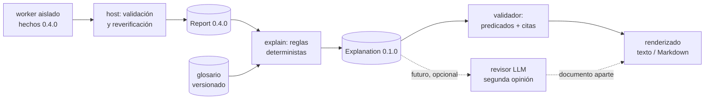

# Fase 3: explicaciones didácticas y glosario con fuentes

Estado: revisión 1 (2026-09-23), implementada en la rama `feat/didactic-glossary` (los diez bloques de la sección 10, cada uno con su commit), sin publicar todavía. El alcance procede de la hoja de ruta ("Motor de glosario y capacidades didácticas, con contenido de fuentes verificables") y del diseño de la Fase 1A, que fijaba este orden: "las plantillas didácticas con citas; después podrán llegar los renderers y la web". El usuario pidió además que la arquitectura prevea un LLM barato y opcional para "verificar mejor en caso de duda". Aquí se diseña ese punto de extensión (sección 9), pero no se implementa.

## 1. Propósito

Hoy Dissect produce un informe JSON correcto pero difícil de leer: el propio usuario lo describió como "todo junto, no se entiende nada". Un estudiante ve `"kind": "section", "permissions": ["read","write","execute"]`, pero no aprende qué es una sección, por qué importa que sea escribible y ejecutable a la vez, ni qué **no** se puede concluir de ello.

Esta fase añade tres cosas:

1. **Glosario**: conocimiento general revisado, con fuentes editoriales verificables. Por ejemplo: qué es una tabla de imports, qué mide la entropía, qué es XOR.
2. **Explicaciones deterministas de la muestra**: frases generadas por reglas a partir de los hechos del informe. Cada frase cita los IDs de evidencia que la respaldan, remite al glosario y dice explícitamente lo que no demuestra.
3. **Un informe legible** en la terminal (y en Markdown), que es lo que ve el usuario por defecto. El JSON sigue disponible con `--json`.

Es el núcleo de "tutor". Funciona sin red y sin LLM (regla obligatoria de `AGENTS.md`).

## 2. Principios que esta fase no puede romper

Proceden del contrato (`docs/evidence-schema.md`, "Regla principal") y se convierten aquí en mecanismos comprobables:

| Regla | Mecanismo en esta fase |
| --- | --- |
| Toda afirmación sobre la muestra sale de hechos estructurados y reglas deterministas | Cada tipo de explicación es una regla con un **predicado** sobre los hechos citados; el validador lo reevalúa (como `validate_anomaly` en la Fase 1A) |
| Citar no basta: lo citado debe respaldar la frase | Las ranuras de la plantilla se rellenan **solo** con campos de los hechos citados, y el validador comprueba que coinciden |
| El glosario se distingue de los hechos | Tres niveles visibles en el modelo y en el renderizado: `observed`, `inferred` y `general` |
| Una importación no prueba ejecución | Toda explicación lleva un texto `no_demuestra` obligatorio, revisado junto a la plantilla |
| Un resultado vacío no prueba ausencia | Las limitaciones y los componentes parciales o bloqueados se explican siempre, antes que los hallazgos |
| Las cadenas de la muestra son datos no fiables | El renderizado neutraliza caracteres de control y secuencias de escape de terminal, y marca las cadenas como citas literales |
| Sin puntuaciones de riesgo | Ninguna explicación agrega un veredicto, una puntuación ni una "gravedad" |

## 3. Alcance

**Incluido:**
- Catálogo de glosario versionado y revisado, en español.
- Explicaciones para todos los tipos de evidencia actuales (`pe_header`, `section`, `entropy`, `import`, `export`, `string`, `header_anomaly`, `yara_match`, `decoded_string`), para el estado del análisis y para cada código de limitación o error.
- Una capa de agrupación didáctica determinista (sección 6.3): por ejemplo, "hay una sección escribible y ejecutable" o "estos imports son de la familia de gestión de memoria de procesos". Se hace solo con listas curadas, sin puntuaciones.
- Renderizado en texto de terminal y en Markdown.
- `dissect analyze` con informe legible por defecto, y `dissect explain <informe.json>` para explicar un informe ya guardado.

**Excluido de esta fase:** interfaz web, capa, FLOSS, VirusTotal, LLM (solo se diseña su punto de extensión) y una ficha por cada API de Windows. El glosario de APIs empieza con una lista curada pequeña (sección 5.3); una ficha por API exigiría fuentes para miles de entradas.

## 4. Arquitectura



- **El worker no cambia.** Las explicaciones se generan en el host, solo a partir de un `Report` ya validado. No vuelven a leer la muestra, así que no amplían la superficie de ataque.
- **Documento separado.** Las explicaciones forman un documento propio (`Explanation`, versión de contrato `0.1.0`, con su JSON Schema) que referencia el informe por el `sha256` de la muestra y por la versión de su esquema. El contrato de hechos 0.4.0 no cambia. Así se puede explicar un informe antiguo o regenerar las explicaciones al mejorar el glosario, sin repetir el análisis.
- **Nuevos módulos:**
  - `src/dissect/glossary/`: carga del catálogo, modelos e integridad.
  - `src/dissect/explain/`: una regla por tipo de evidencia, el agrupador didáctico y el validador.
  - `src/dissect/render/`: texto y Markdown, con escapado.
- **Sin dependencias nuevas.** El catálogo usa TOML (`tomllib` de la biblioteca estándar). El renderizado es texto plano propio. No se usa el marcado de `rich`, porque interpretaría como formato los corchetes de las cadenas de la muestra (inyección de marcado).

## 5. Glosario

### 5.1 Formato

Una entrada por archivo en `src/dissect/glossary/entries/*.toml`, más un `manifest.json` con el digest SHA-256 de cada archivo y del conjunto, igual que el catálogo YARA de la Fase 1B. El cargador rechaza una entrada cuyo digest no coincide con el manifiesto, así que todo cambio de contenido exige volver a fijarlo de forma explícita (`python -m dissect.glossary.catalog --write <revisión>`). Todas las entradas son conocimiento general: no llevan campo de nivel.

```toml
id = "pe.section.permissions"
title = "Permisos de una sección"
revision = "1.0.0"
lang = "es"
summary = "Cada sección declara si su contenido se puede leer, escribir o ejecutar una vez cargado en memoria."
body = """..."""
not_proven = "Los permisos declarados no demuestran que el programa escriba o ejecute esa región."
related = ["pe.section", "entropy.shannon"]

[[sources]]
title = "PE Format — Section Flags"
publisher = "Microsoft Learn"
url = "https://learn.microsoft.com/en-us/windows/win32/debug/pe-format#section-flags"
verified_on = 2026-09-23
```

Reglas del catálogo:
- Cada entrada tiene al menos una fuente editorial: documentación del fabricante, un RFC o estándar, la documentación oficial de la herramienta o un artículo académico. No valen blogs anónimos.
- `verified_on` registra cuándo una persona o un agente comprobó que la URL existe y respalda el texto. La CI no accede a la red. Un script manual, `tests/check_glossary_sources.py`, comprueba que las URL responden; no comprueba su contenido, y la documentación lo dirá.
- El texto del glosario es conocimiento general: nunca menciona la muestra.
- Los identificadores son estables. Retirar una entrada exige una nueva revisión del catálogo.

### 5.2 Contenido inicial (conceptos)

- **Formato**: PE, cabecera PE, PE32/PE32+, punto de entrada, SizeOfImage.
- **Secciones**: sección, permisos, datos crudos frente a tamaño virtual.
- **Entropía**: entropía de Shannon por bytes. Una entropía alta es compatible con compresión o cifrado, pero no prueba empaquetado.
- **Imports y exports**: tabla de imports, imports retardados, importación por ordinal, exports y forwarders.
- **Cadenas**: cadenas ASCII y UTF-16LE.
- **Anomalías**: una entrada por cada código de anomalía de la Fase 1A.
- **YARA**: qué es una regla y qué significa una coincidencia. Cada regla del catálogo propio se explica con la descripción revisada de su manifiesto, que ya incluye lo que no demuestra, para no mantener dos textos de la misma regla.
- **Decodificación**: Base64, hexadecimal, XOR de clave repetida, crib, reutilización de clave y la diferencia entre `observed` e `inferred`.
- **Integridad del informe**: SHA-256, MD5 (con sus colisiones conocidas), análisis parcial y limitaciones.

Fuentes previstas: la especificación PE de Microsoft Learn, la documentación oficial de YARA, RFC 4648 (Base64 y hexadecimal), RFC 2781 (UTF-16), FIPS 180-4 (SHA-256), RFC 1321 y RFC 6151 (MD5 y su seguridad) y Shannon (1948). Cada URL se comprueba al escribir la entrada. Los conceptos que define el propio Dissect (niveles de confianza, crib, reutilización de clave, cobertura) citan su documento del proyecto con ruta y ancla (`document = "docs/…#ancla"`), porque el repositorio es privado y una URL de GitHub no sería verificable para el lector. Un test comprueba que cada ancla existe.

Estado (2026-09-23): 29 entradas. Las 27 fuentes externas responden y sus anclas existen (`tests/check_glossary_sources.py`).

### 5.3 APIs curadas

Una lista corta de funciones de Windows frecuentes en la enseñanza, agrupadas por familia: memoria de procesos, carga dinámica, red, registro, servicios, criptografía y anti-depuración. Cada una remite a su página de Microsoft Learn, comprobada una a una. Nunca se genera una URL a partir de un nombre, porque eso sería inventar una fuente. Un import sin ficha se explica con la entrada genérica "tabla de imports", sin especular sobre la función.

## 6. Explicaciones

### 6.1 Modelo

```text
Explanation (documento)
  schema_version = "0.1.0"
  report: {sample_sha256, report_schema_version}
  glossary: {catalog_id, revision, digest}
  status_notes[]   # estado del análisis, componentes parciales y limitaciones (siempre primero)
  items[]:
    id              # "X1", "X2"... local al documento
    rule            # p. ej. "section.writable_executable@1"
    level           # observed | inferred
    statement       # texto generado a partir de la plantilla
    slots           # valores usados, tipados
    evidence_ids[]  # hechos citados (>= 1)
    glossary_ids[]  # entradas enlazadas (>= 1)
    not_proven      # texto obligatorio
```

`level` hereda la confianza más débil de lo citado: una explicación que cita una `decoded_string` es `inferred`. El nivel `general` pertenece solo al glosario y nunca se asigna a una frase sobre la muestra.

### 6.2 Reglas por tipo de evidencia

Cada regla es una función pura `(hechos citados) -> Item | None` con versión propia, y va emparejada con un predicado que el validador reevalúa. Ejemplos:

| Regla | Predicado sobre lo citado | Frase (plantilla) | No demuestra |
| --- | --- | --- | --- |
| `section.writable_executable@1` | una `section` con `write` y `execute` | "La sección «{name}» (índice {index}) declara permisos de escritura y ejecución a la vez." | Que se escriba código en ella ni que se ejecute. |
| `entropy.high@1` | `entropy.value ≥ 7,2` sobre una sección citada | "Los bytes de «{name}» tienen una entropía de {value:.2f} bits/byte." | Empaquetado ni cifrado: los datos comprimidos (imágenes, recursos) también la tienen. |
| `import.entry@1` | un `import` | "La tabla de imports declara {dll}!{name}." | Que la función se llame ni con qué fin. |
| `decoded.xor@1` | una `decoded_string` con transformación XOR | "Aplicar XOR con la clave {key} a {length} bytes en el desplazamiento {offset} produce el texto citado." | Que el programa realice esa operación ni que use el texto. |
| `yara.match@1` | un `yara_match` | "La regla {rule} de Dissect coincide en {n} posiciones." | Lo indicado en la descripción de la regla en el catálogo. |
| `limitation.*@1` | un código de limitación | "El componente {component} no terminó: {motivo}." | Que lo no analizado esté ausente. |

El umbral de entropía (7,2) es un parámetro didáctico ("cerca del máximo de 8"), no un detector. **Medido el 2026-09-23** sobre 55.313 binarios benignos (System32, Program Files y Program Files (x86)), con la misma fórmula que Dissect: de 251.225 secciones con bytes en disco, 508 (0,2 %) alcanzan 7,2. De las 139.057 secciones de 4 KiB o más, 475 (0,34 %). Por nombre: `.rsrc` 0,6–0,8 %, `.rdata` 0,2–0,3 %, `.text` 0,1–0,2 %. La regla `entropy.high@1` solo se aplica a secciones de 4 KiB o más, porque con pocos bytes la estimación se acerca a 8 simplemente porque apenas se repiten valores. La frase publica la cifra del 0,34 % y su advertencia dice que ese 0,34 % son programas legítimos.

### 6.3 Agrupaciones didácticas

Son reglas deterministas que resumen varios hechos citándolos todos. Por ejemplo, "3 imports pertenecen a la familia *memoria de otros procesos* (lista curada v1)". La pertenencia a una familia sale de una lista revisada y versionada, igual que las cribs, y se explica como "estos nombres aparecen en la lista", nunca como "la muestra inyecta código". No hay puntuaciones ni veredictos, y una agrupación vacía no se muestra como "no hace X".

**Implementado (2026-09-23): lista `dissect-api-families-v1`**, con nueve familias de nombres exactos (variantes A y W incluidas), digest fijado por un test y una entrada de glosario por familia. Cada entrada cita entre 4 y 7 páginas de Microsoft Learn, comprobadas una a una: 48 páginas existen y mencionan su función. La regla `imports.family@1` cita todos los imports de la familia y publica su prevalencia benigna, medida sobre 55.035 binarios PE (System32, Program Files y Program Files (x86)) como la fracción que importa por nombre al menos una función de la familia:

| Familia | Binarios benignos que la importan |
| --- | --- |
| Carga dinámica de bibliotecas | 34,8 % |
| Comprobación de depuradores | 32,2 % (sobre todo `IsDebuggerPresent`, del runtime de C de Microsoft) |
| Registro de Windows | 10,6 % |
| Creación de procesos | 4,8 % |
| Memoria de otros procesos | 3,7 % |
| Criptografía | 3,0 % |
| Sockets de red | 2,1 % (los imports por ordinal de ws2_32 no se cuentan) |
| Servicios de Windows | 1,7 % |
| HTTP y descargas | 1,0 % |

La cifra es el contrapeso didáctico: enseña que estas funciones aparecen en software legítimo y que una familia no es un veredicto. Cambiar las listas exige una nueva versión y repetir la medición.

### 6.4 Validador

Antes de renderizar, `validate(explanation, report, glossary)`:
1. Comprueba que existen los IDs de evidencia y las entradas de glosario citados.
2. Reevalúa el predicado de cada regla sobre los hechos citados.
3. Regenera la frase con la plantilla y los `slots` y exige igualdad exacta, para que ninguna frase se desvíe de su plantilla.
4. Comprueba que `level` es coherente con la confianza de lo citado.
5. Comprueba que cada componente parcial o bloqueado y cada limitación tienen su nota.

Una explicación que no pasa la validación no se muestra. La regla de la Fase 1A lo exige: "si no se puede validar una afirmación, se omitirá".

## 7. Renderizado

Orden fijo: (1) qué es la muestra (hashes, tamaño, tipo); (2) **qué no se pudo analizar**; (3) hechos observados por tema; (4) inferencias, separadas y marcadas; (5) glosario de los términos usados, con sus fuentes.

- **Seguridad del texto**: toda cadena procedente de la muestra (nombres de sección, imports, cadenas, textos decodificados) pasa por un escapado que sustituye los caracteres de control C0/C1, ESC, DEL y los caracteres Unicode de control de dirección (bidi) por secuencias visibles (`\x1b`, `\u202e`), y se presenta entre comillas angulares. Una muestra no puede alterar la terminal ni el orden visual del texto. Hay tests con secuencias ANSI, OSC 8 (hipervínculos de terminal) y bidi.
- **Markdown**: las cadenas de la muestra van en bloques de código con una valla más larga que cualquier racha de acentos graves que contengan, para que no puedan inyectar enlaces, imágenes ni HTML.
- **CLI**: `dissect analyze muestra` muestra el informe legible; `--json` emite el JSON validado actual; `--markdown` emite Markdown. `dissect explain informe.json` valida un informe guardado (sin volver a analizar la muestra) y lo explica. Los códigos de salida no cambian.

## 8. Pruebas y criterios de aceptación

| Área | Prueba | Afirmación que debe impedir |
| --- | --- | --- |
| Glosario | Digest y manifiesto, campos obligatorios, fuente por entrada, IDs únicos, enlaces `related` existentes | Contenido sin revisar o sin fuente |
| Reglas | Una prueba positiva y otra negativa por regla, con informes sintéticos | Frases sin respaldo en los hechos citados |
| Validador | Frase manipulada, predicado falso, ID inexistente, nivel `observed` sobre un hecho `inferred`, limitación omitida | Explicaciones alteradas o que ocultan límites |
| Abstención | Informe `failed` o `partial`, componente bloqueado, informe vacío | "No se encontró nada" presentado como "no tiene nada" |
| Seguridad | ANSI/OSC/bidi en nombres de sección, imports y cadenas; acentos graves en Markdown | Inyección en terminal o en Markdown |
| CLI | `analyze` legible, `--json` idéntico al actual, `explain` sobre un informe válido y sobre uno manipulado | Romper consumidores del JSON |
| Regresión | Suite completa y pruebas Docker | Perder garantías previas |

## 9. Punto de extensión para un LLM (diseñado, no implementado)

El usuario quiere más adelante un LLM barato para "verificar mejor en caso de duda". Encaja sin romper las reglas si se trata como un **revisor externo cuyas opiniones nunca se convierten en hechos**:

- **Dónde se ejecuta**: solo en el host, nunca en el worker, desactivado por defecto y con configuración explícita (proveedor, modelo y clave en variables de entorno). Sin LLM, Dissect funciona igual.
- **Qué recibe**: únicamente el documento `Explanation` y los hechos que cita, serializados como datos. Nunca los bytes de la muestra. Las cadenas de la muestra van delimitadas y marcadas como datos no fiables, con instrucciones de sistema que las declaran no ejecutables (la cadena de una muestra puede ser una inyección de prompt).
- **Qué puede devolver**: un documento aparte, `Review`, validado con esquema, que referencia el `sha256` y los IDs de explicación. Cada opinión es `coherente`, `dudosa` o `no_evaluable`, con un motivo que solo puede citar IDs existentes. No puede añadir hechos, cambiar niveles de confianza, ocultar limitaciones ni sustituir la abstención determinista.
- **Dónde se usa primero**: en los casos de duda que Dissect ya marca como `inferred`. Por ejemplo, si un texto XOR decodificado parece lenguaje natural o un artefacto, o qué familia didáctica encaja mejor con un grupo de imports.
- **Cómo se muestra**: en una sección separada, "Segunda opinión (modelo X, no verificada)". La regla 4 del contrato se mantiene: una respuesta del LLM no promueve una hipótesis a hecho.
- **Qué deja preparado esta fase**: IDs de explicación estables dentro del documento, `level` explícito y un validador reutilizable para comprobar que el `Review` solo cita lo que existe. No se añade ningún campo al contrato hasta implementarlo.

## 10. Plan de implementación

Bloques pequeños, cada uno con pruebas primero, verificación completa y commit propio:

1. Este diseño y la actualización de la hoja de ruta.
2. Formato y cargador del glosario, manifiesto con digest, tests de integridad y el script manual de fuentes.
3. Contenido del glosario: conceptos de la sección 5.2, con cada fuente comprobada.
4. Modelo `Explanation`, su JSON Schema y el validador (sección 6.4) con sus pruebas negativas.
5. Reglas por tipo de evidencia y notas de estado y limitaciones.
6. Medición del umbral de entropía sobre el corpus benigno y regla `entropy.high`.
7. Renderizado de texto y Markdown con escapado y tests de inyección.
8. CLI: `analyze` legible por defecto, `--json`, `--markdown` y `explain`.
9. Lista curada de APIs y agrupaciones didácticas.
10. Documentación, demostración con el fixture sintético e integración en Docker y CI.
